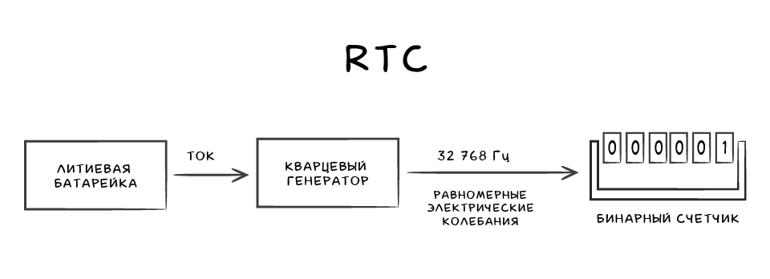
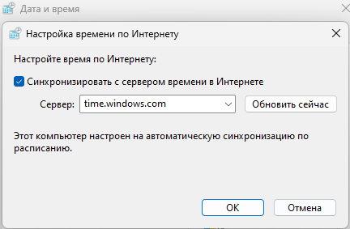
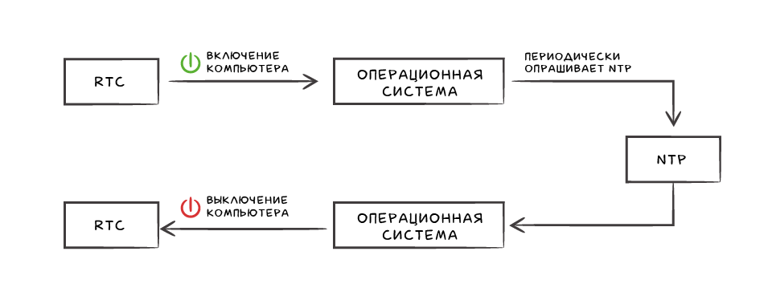
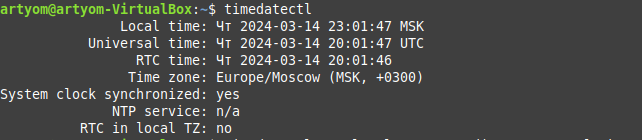
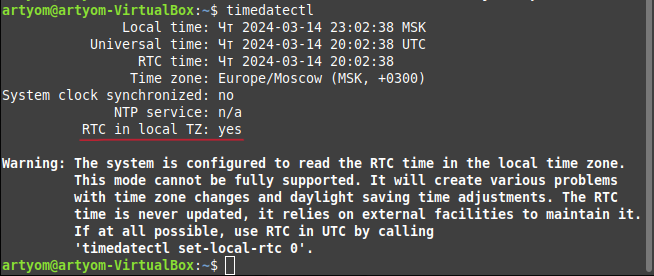

# Представление времени в Unix и Windows. Понятие "Эпоха". Аппаратные часы. Системное время

> Герасимов Артём Кириллович  
> P33111  
> 2024

## Введение. Всемирное координированное время (UTC)

В данной статье мы разберёмся как операционные системы Unix и Windows представляют время и отслеживают его, когда компьютер выключен.

Для понимая темы нам также нужно (очень кратко) ознакомится с **UTC**.

**Всемирное координированное время** или **UTC** (англ. Coordinated Universal Time) - универсальный мировой стандарт времени.

*Примечание: несовпадение акронима было вызвано необходимостью универсальности его для всех языков.*

Главной задачей стандарта является обеспечение единого и точного времени для координации и согласования любых действий.

**UTC** пришел на смену среднего времени по Гринвичу или **GMT** (англ. Greenwich Mean Time). Как и предшественник, оно имеет единую точку отсчета –  Гринвичский меридиан, а весь земной шар делится на 24 зоны (часовые пояса), каждый из которых имеет своё смещение. Соответственно , чтобы узнать местное время нужно к эталонному времени **UTC** добавить или вычесть поправку на часовой пояс.

## Аппаратные часы - часы реального времени (RTC)

**Часы реального времени** или **RTC** (англ. Real Time Clock) — электронная схема, предназначенная для измерения времени.

В 1984 году компания IBM выпустила IBM PC/AT, в составе которого впервые были представлены **RTC**. Это была отдельная микросхема (изначально Motorola MC146818, затем использовались микросхемы компании Dallas Semiconductor) с кварцевым резонатором, работающим от встроенной батарейки на частоте 32768 Гц. К слову, эта же частота используется в современных кварцевых часах. Она обеспечивает $2^{15}$ циклов в секунду, что очень удобно для простых двоичных счётчиков.

Отдельная микросхема применялась вплоть до 2000-х годов, пока ей на смену не пришло решение, основанное на интеграции **RTC** в южный мост и снабжении их энергией от батарейки CMOS (также используется для хранения настроек BIOS).

Данное решение применяется в большинстве современных компьютеров и именно благодаря этому часы продолжают идти в независимости от того включен компьютер или нет.



При выходе батарейки из строя настройки BIOS, включая текущее время, сбросятся на значения по-умолчанию, для времени это значение - дата изготовления микросхемы южного моста.

**RTC** хоть и позволяет считать время пр выключенном компьютере, имеет большой недостаток - погрешность от 1.7 до 8.6 секунд.

## Понятие "Эпоха" и Unix-время

**Эпоха** (англ. Epoch) - это фиксированные дата и время, эталон, по которым компьютер измеряет системное время.

Большинство компьютерных систем определяют время как количество секунд, прошедших (обычно) с полуночи **UTC** определённой произвольной даты.

Время в **Unix** и других POSIX-совместимых операционных системах определяется как количество секунд, прошедших с 00:00:00 **UTC** 1 января 1970 года. Этот момент времени известен как **"эпоха Unix"** (также: **Unix epoch**, **Unix-time**, **Unix-время**, **POSIX-время**)

В момент времени 00:00:00 **UTC** 1 января 1970 года **Unix-время** равно 0.

**Unix-время** по сути является международным стандартном и используется не только в **Unix-like** системах, но и, к примеру, во многих языках программирования.

В **Unix-like** системах для получения текущей даты и времени можно использовать команду ```date```, а для получения текущего **Unix-времени** команду ```date +%s```.

В программах для хранения **Unix-времени** используется целочисленный знаковый тип.

32-битные числа со знаком могут ссылаться на моменты времени от пятницы 13 декабря 1901 года 20:45:52 до вторника 19 января 2038 года 03:14:07 включительно. В этом и заключается известная **Проблема 2038 года** - после 19 января 2038 года 03:14:07 произойдёт переполнение.

## Системное время

Кварцевый резонатор, расположенный на материнской плате способен генерировать стабильные колебания определенной частоты. Данные колебания (или таймер) позволяют процессору синхронизировать производимые им операции во времени.

Операционная система может измерить время, которое проходит между срабатываниями (тикам) таймера.

К примеру в **Linux** для этого используется глобальная переменная **jiffies**, которая увеличивается на 1 каждый раз, когда процессор дает сигнал о новом тике. Другими словами, она содержит количество импульсов системного таймера, которые были получены со времени загрузки системы.

Таким образом, чтобы узнать, как долго включен компьютер, система умножает размер периода между тиками на количество тиков. А чтобы узнать текущее время, нужно добавить прошедшее время к времени на момент старта системы, которое система получает с помощью **RTC**.

**Unix** кодируют системное время как количество секунд, прошедших с начала **эпохи Unix**.

## Windows, WinAPI, Windows epoch

При первом запуске **Windows**, системное время устанавливается на основе **RTC**, а затем регулярно обновляет время (описано выше).

Для получения текущего системного времени используется функция ```GetSystemTime```, которая копирует время в структуру ```SYSTEMTIME```, содержащую все элементы даты и времени в формате **UTC** (год/месяц/день/день недели/час/минута/секунда/миллисекунды):

```c++
typedef struct _SYSTEMTIME {
    WORD wYear;
    WORD wMonth;
    WORD wDayOfWeek;
    WORD wDay;
    WORD wHour;
    WORD wMinute;
    WORD wSecond;
    WORD wMilliseconds;
} SYSTEMTIME, *PSYSTEMTIME, *LPSYSTEMTIME;
```

Благодаря данному формату время легко можно отобразить в пользовательском интерфейсе.

Кроме того существует также "**эпоха Windows**" (**Windows epoch**), которая  измеряется как количество 100-наносекундных интервалов, прошедших с 00:00:00 **UTC** 1 января 1601 года. Данное 64-разрядное значение хранится в структуре **FILETIME**:

```c++
typedef struct _FILETIME {
    DWORD dwLowDateTime;
    DWORD dwHighDateTime;
} FILETIME, *PFILETIME, *LPFILETIME;
```

**Windows** использует данную структуру для записи создания/открытия/изменения файла.

Важное замечания: файловая система NTFS хранит время в формате **UTC**, а файловая система FAT на основе местного времени.

### Функции WinAPI для работы со временем

- ```GetSystemTimeAsFileTime``` - получение системного времени в формате времени файла ```FILETIME```.
- ```SystemTimeToFileTime``` - преобразование системного времени в время файла.
- ```GetLocalTime``` - получение местного времени (с учётом Timezone). Данная функция преобразует системное время в местное время на основе текущих параметров часового пояса.
- ```GetTimeZoneInformation``` - получения параметров часового пояса.
- ```SystemTimeToTzSpecificLocalTime``` - преобразование времени **UTC** в местное время.
- ```TzSpecificLocalTimeToSystemTime``` - преобразование местного времени в время **UTC**
- ```GetFileTime``` - получение времени файла для указанного файла.
- ```FileTimeToSystemTime``` - преобразование времени файла в системное время
- ```GetTickCount64``` - количество миллисекундах, прошедших с момента запуска системы

## Протокол сетевого времени NTP

**Протокол сетевого времени** или **NTP** (Network Time Protocol) - сетевой протокол, используемый для синхронизации времени между компьютерами в сети.

Операционные системы используют **NTP** для синхронизации времени с серверами, что позволяет поддерживать точное (в публичной сети погрешность составляет всего 10 мс.) время

Именно благодаря **NTP** в ОС устанавливается местное время (с учётом Timezone)

Для просмотра информации о **NTP** серверах на ОС на базе **Linux** можно использовать команду ```ntpq -p```.

ОС **Windows** по-умолчанию использует **NTP** сервер Microsoft:



## Алгоритм работы

Разобравшись, что такое **RTC**, **UTC**, **NTP** и то как представляется время в **Unix-like** и **Windows** системах, обобщим то как они взаимодействуют и как компьютер и ОС знают текущее время:

- При загрузке ОС для системных часов устанавливается значение из аппаратных часов.
- Поддерживается точное время системных часов с помощью протокола **NTP**;
- При выключении для аппаратных часов устанавливается значение из системных часов.
- Аппаратные часы отслеживают время, когда компьютер выключен.



## Конфликт Windows и Linux при Multi-boot

Ведущими (главными) являются именно **системные часы**: любое изменение показаний этих часов приводит к корректировке показаний аппаратных часов (**RTC**).

В ОС на базе **Linux** по умолчанию подразумевается, что **RTC** установлены в соответствии с **UTC**, в отличие от **Windows**, где **RTC** установлены по местному времени (с учётом Timezone).

Из-за этого возникает проблема, когда мы имеем несколько операционных систем (Multi-boot) на одном компьютере, допустим **Windows 11** и **Linux Mint**.

Предположим, что мы находимся в часовом поясе Москвы, т.е. **UTC+3** и текущее время - 15:00, следовательно время **UTC** - 12:00. **Linux Mint** синхронизирует эту информацию  с аппаратными часами, но со смещением, таким образом значение **RTC** - 12:00.

Если мы загрузим **Windows** 11, то увидим, что она отображает в системном трее 12:00, а не 15:00, т.к. **Windows** считает, что **RTC** уже учитывают местное время. Таким образом **Windows** показывает время, которое отстает от фактического на 3 часа.

Если вручную установить правильное местное время, отключив автоматическое определение в настройках, то тогда время будет показываться корректно - 15:00. Однако **Windows** синхронизирует это с **RTC**. Таким образом значение **RTC** будет равно 15:00.

Если загрузить **Linux Mint**, то мы увидим в системном трее 18:00, а не 15:00, т.к. **Linux** считает, что **RTC** использует **UTC** время и поэтому добавляет смещение +3. Таким образом **Linux** показывает время, которое опережает фактическое на 3 часа.

Данную проблему можно решить двумя способами:

1. **Заставить Linux использовать местное время** (*не рекомендуется*)

    Для этого нужно использовать следующую команду:

    ```bash
    timedatectl set-local-rtc 1 --adjust-system-clock
    ```

    До:

    

    После:

    

    Для отмены:

    ```bash
    timedatectl set-local-rtc 0 --adjust-system-clock
    ```

2. **Заставить Windows использовать UTC время**

    Сохранить как .reg файл и выполнить:

    ```reg
    [HKEY_LOCAL_MACHINE\System\CurrentControlSet\Control\TimeZoneInformation]
    "RealTimeIsUniversal"=dword:00000001
    ```

    Для отмены:

    ```reg
    [HKEY_LOCAL_MACHINE\System\CurrentControlSet\Control\TimeZoneInformation]
    "RealTimeIsUniversal"=-
    ```

## Выводы

- Для работы системного времени используется кварцевый резонатор на мат. плате.
- ОС использует протокол **NTP** для корректировки времени.
- При выключенном компьютере время считает **RTC**, работающие от CMOS батарейки.
- **Эпоха (Epoch)** - произвольная дата, от которой рассчитывают время.
- **Unix-время** - кол-во секунд, прошедших с начала 00:00:00 **UTC** 1 января 1970 года.
- В WinAPI есть две структуры для представления времени: ```SYSTEMTIME``` и ```FILETIME```.
- Для хранения лучше использовать международный формат **UTC**, а не местное время.
- При установке нескольких различных ОС, требуется небольшая правка для корректного отображения времени

## Источники

<https://learn.microsoft.com/ru-ru/windows/win32/sysinfo/time>

<https://guides.hexlet.io/ru/time/>

<https://wiki.archlinux.org/title/System_time>

<https://www.howtogeek.com/323390/how-to-fix-windows-and-linux-showing-different-times-when-dual-booting/>
